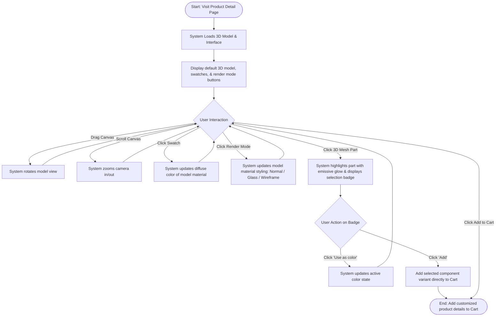
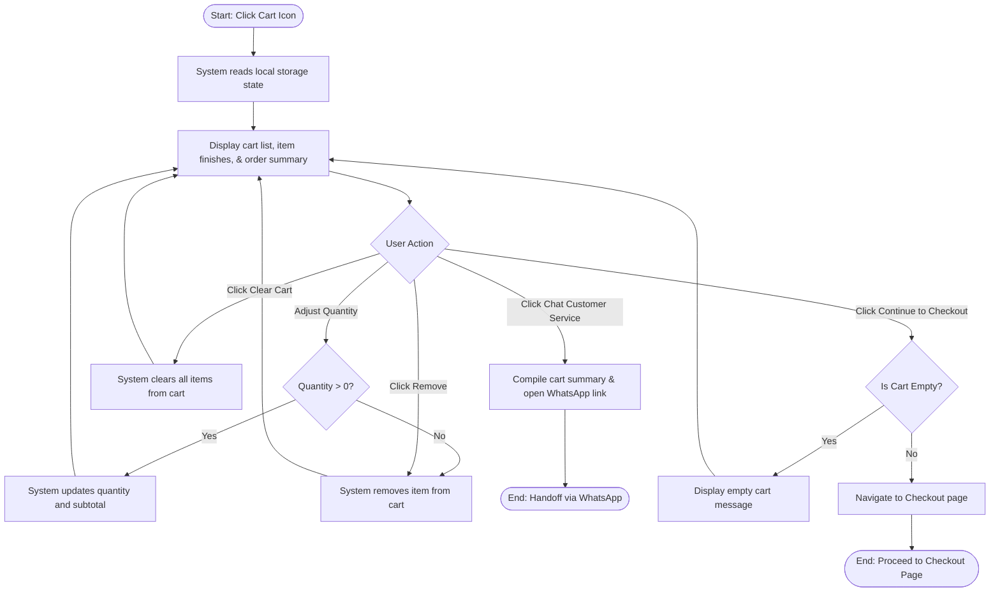
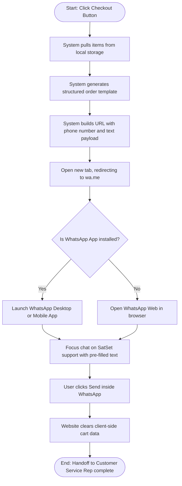

# SatSet — Comprehensive HCI Project Portfolio Report
**Class**: Human-Computer Interaction  
**Semester**: Even Semester 2025/2026  
**Team**: SatSet  
**Team Members**:
* **Ken Prasetya** — Customer Experience & Insights (Team Lead)
* **Aqsha Rahman** — Product Engineer & 3D Specialist
* **Cent Prabowo** — Surface Finish & Visual Lead
* **Jes Kartika** — Materials Scientist & QA Lead
* **Kelvin Wijaya** — Prototype Technician & Developer

**Team Drive URL**: [Google Drive Folder - SatSet Project](https://drive.google.com/drive/folders/satset-hci-2026)

---

## Table of Contents
1. [TA01 — Project Proposal](#ta01--project-proposal)
2. [TA02 — Product Requirement Document (PRD)](#ta02--product-requirement-document-prd)
3. [TA03 — User & Task Analysis](#ta03--user--task-analysis)
4. [TA04 — Activity Design & Paper Prototyping](#ta04--activity-design--paper-prototyping)
5. [TA05 — High Fidelity Prototyping](#ta05--high-fidelity-prototyping)
6. [TA06 — Heuristic Evaluation & Revision #1](#ta06--heuristic-evaluation--revision-1)
7. [TA07 — User Testing & Revision #2](#ta07--user-testing--revision-2)
8. [TA08 — Final Project Report & Reflections](#ta08--final-project-report--reflections)

---

## TA01 — Proposal Proyek (Project Proposal)

### 1. Rumusan Masalah (Problem)
Gaya hidup modern yang dinamis, pergeseran ke sistem kerja *hybrid* (gabungan bekerja dari rumah, kantor, dan ruang publik), serta mobilitas yang tinggi menuntut para profesional aktif untuk membawa barang pribadi esensial mereka—seperti kartu identitas, kartu akses kantor, kartu debit/kredit, dan uang tunai—secara lebih efisien, ringkas, dan aman. Namun, pasar aksesoris penyimpanan pribadi saat ini masih menghadapi beberapa kendala utama yang belum terpecahkan dengan baik:
* **Masalah Kerapian dan Penumpukan Barang (Clutter & Disorganization)**: Dompet lipat tradisional cenderung menimbun barang-barang yang tidak diperlukan (seperti struk belanja lama, koin, dan kartu yang tidak aktif). Hal ini menghasilkan bentuk dompet yang tebal (*bulky*) yang tidak hanya merusak penampilan dan kenyamanan saku celana, tetapi juga memperantak meja kerja minimalis serta memicu beban kognitif (*cognitive load*) tambahan bagi penggunanya secara visual.
* **Pengalaman Belanja E-commerce yang Statis**: Saat berbelanja aksesoris *lifestyle* premium secara online, calon pembeli tidak dapat memeriksa fisik produk secara taktil dan visual yang menyeluruh. Foto studio 2D yang statis sering kali mengalami distorsi warna akibat penyuntingan berlebih atau gagal merepresentasikan skala ketebalan, detail potongan sudut (*chamfer*), tekstur permukaan metal, serta berat material yang sebenarnya. Hal ini kerap memicu keraguan saat membeli atau memicu kekecewaan setelah produk sampai.
* **Kurangnya Kustomisasi Personal**: Produk-produk massal yang beredar di pasaran saat ini memiliki desain yang seragam dan kaku. Mereka tidak menyediakan opsi kustomisasi yang memadai untuk mengakomodasi selera estetika personal atau kebutuhan kapasitas penggunaan yang bervariasi dari setiap individu.

**SatSet** hadir untuk mengatasi rangkaian masalah ini dengan memproduksi katalog utilitas fisik minimalis dan premium yang berpusat pada *cardholder* berbahan aluminium anodisasi kelas pesawat (*aircraft-grade anodized aluminium*) yang dilengkapi pelindung RFID (*RFID shielding*). Untuk melengkapi produk fisik ini, kami merancang platform konfigurasi 3D interaktif berbasis web (*High-Fidelity*). Dengan teknologi ini, pengguna dapat menyimulasikan penggunaan, menyesuaikan konfigurasi warna/aksesoris, dan menginspeksi produk secara spasial dari segala sudut dalam lingkungan WebGL sebelum membelinya, sehingga mengeliminasi keraguan visual dan membangun kepercayaan diri penuh calon pengguna.

---

### 2. Target Pengguna (Target Users)
Populasi target utama kami adalah para profesional aktif (usia awal hingga pertengahan karier, berkisar antara 22–45 tahun) yang menghargai kegunaan fungsional tingkat tinggi, ketelitian detail desain, serta kualitas material produk.

* **Pengguna Utama 1 (Pekerja Kantoran Hybrid & Kreatif)**: Pekerja kantoran yang *tech-savvy*, desainer, arsitek, pengembang perangkat lunak, serta eksekutif muda yang sering berpindah ruang kerja (kantor, kafe, *co-working space*). Mereka menyukai ruang kerja yang bersih (*clean setup*), mengapresiasi objek fungsional berdesain minimalis, dan sangat memperhatikan keselarasan estetika antara aksesoris pribadi dengan gawai kerja mereka.
* **Pengguna Utama 2 (Komuter Urban & Traveler)**: Pengguna transportasi publik perkotaan (seperti MRT, KRL, busway) dan pelancong bisnis (*business travelers*) yang membutuhkan aksesibilitas cepat (*sat-set*) untuk kartu akses tanpa harus mengeluarkan dompet tebal dari tas, serta memerlukan keamanan digital bawaan berupa pelindung RFID untuk mencegah skimming ilegal nirkabel di tempat umum.
* **Karakteristik Interaksi**: Kelompok pengguna ini sangat terbiasa dengan antarmuka web modern yang interaktif, menuntut standar estetika visual yang tinggi, dan fleksibel menggunakan PC desktop (untuk melakukan kustomisasi detail visual) maupun telepon seluler (untuk penelajahan produk secara cepat dan penyelesaian transaksi).

---

### 3. Solusi (Solution)
Solusi kami adalah menghadirkan platform web e-commerce responsif yang mengintegrasikan pratinjau dan konfigurator 3D interaktif secara *real-time*.

* **Kustomisasi 3D Interaktif (WebGL)**: Kami membangun kanvas 3D interaktif menggunakan Three.js dan `@react-three/fiber` yang memungkinkan pengguna untuk memutar model produk secara bebas (*orbit*), memperbesar detail sambungan dan sudut (*zoom*), serta memicu simulasi mekanik (seperti pendorongan kartu keluar/ejector). Pengguna dapat langsung memodifikasi warna anodisasi aluminium (seperti *matte black*, *space grey*, *sand gold*, atau *forest green*) dan melihat interaksi cahaya terhadap permukaan material metal tersebut secara nyata di layar.
* **Gaya Desain Premium & Editorial**: Untuk mencerminkan kemewahan produk fisik SatSet, antarmuka situs web dirancang menggunakan skema warna mode gelap dengan palet warna hangat bernuansa bumi (menggunakan warna dasar `#231711`). Kami memadukan font serif yang elegan untuk judul editorial guna membangun ritme visual yang eksklusif, serta font sans-serif (Inter) untuk keterbacaan menu navigasi yang optimal. Animasi transisi antar-elemen halaman diatur secara halus menggunakan GSAP (*GreenSock Animation Platform*).
* **Checkout WhatsApp Minim Friksi (WhatsApp Handoff)**: Mengurangi rintangan administratif yang sering dikeluhkan pembeli online. Calon pembeli tidak diwajibkan melewati proses registrasi akun baru yang rumit atau memasukkan nomor kartu kredit mereka di gerbang pembayaran asing. Sistem akan mengompilasi detail barang yang ada dalam keranjang belanja secara otomatis menjadi draf pesan teks ringkasan pesanan (*order summary*) yang rapi, lalu mengalihkan pengguna ke aplikasi WhatsApp Customer Service SatSet untuk menyelesaikan pembayaran lokal (seperti QRIS atau transfer bank) secara personal dan aman.

---

### 4. Evaluasi Proposal (Problem & Solution Questions)

#### Are there problems with an existing product or user experience? If so, what are they?
Ya, kami mengidentifikasi adanya kesenjangan besar pada dua aspek pengalaman pengguna produk saat ini:
1. **Aspek Fisik**: Dompet lipat konvensional berbahan kulit/sintetis mudah aus, tidak memiliki perlindungan dari skimming nirkabel RFID, dan berdimensi tebal sehingga tidak cocok diletakkan di meja kerja modern yang minimalis. Sementara itu, opsi *cardholder* besi yang ada di pasar lokal sering kali terlalu berat, memiliki sudut tajam yang dapat merusak saku pakaian, atau memiliki mekanisme keluaran kartu yang macet.
2. **Aspek Pengalaman Digital**: E-commerce aksesoris premium saat ini sangat membosankan karena hanya mengandalkan foto studio 2D statis. Foto semacam ini sering kali diambil dari sudut tertentu saja dan rentan manipulasi warna lampu studio, sehingga pembeli kesulitan memperkirakan dimensi asli, proporsi skala terhadap tangan, kecocokan warna dengan meja kerja mereka, dan tekstur material yang sebenarnya.

#### Why do you think there are problems?
Masalah ini muncul karena platform e-commerce pada umumnya mengutamakan fungsionalitas transaksi massal yang murah dan cepat, tanpa mengindahkan keterlibatan emosional serta kepuasan indrawi pembeli (*experiential shopping*). Aksesoris premium adalah produk yang dihargai karena presisi pembuatan, detail lekukan, dan kualitas taktilnya. Ketika interaksi fisik ini dipangkas menjadi sekadar gambar 2D statis di layar, pembeli kehilangan kemampuan untuk menilai kualitas produk tersebut secara objektif, yang akhirnya menurunkan tingkat kepercayaan mereka untuk melakukan transaksi.

#### What evidence do you have to support the existence of these problems?
* **Tingkat Pengembalian Barang yang Tinggi (High Return Rates)**: Berdasarkan studi industri e-commerce fesyen dan aksesoris, tingkat pengembalian barang berkisar antara 15-20%, di mana alasan mayoritas pembeli adalah "produk asli tidak sesuai dengan ekspektasi visual dari foto di situs web."
* **Hasil Wawancara Pengguna Awal**: Kami melakukan wawancara semi-terstruktur dengan 5 profesional aktif yang sesuai dengan profil target pengguna kami. Hasilnya menunjukkan bahwa seluruh partisipan (100%) merasa ragu untuk membeli dompet metal premium secara online karena khawatir akan ketebalan asli produk saat diisi kartu dan akurasi warna metalik di bawah pencahayaan ruangan nyata.
* **Analisis Pasar Lokal (Market Gap)**: Berdasarkan riset pasar pada situs web brand aksesoris sejenis di Indonesia, belum ada brand lokal yang menawarkan fitur visualisasi 3D kustomisasi yang interaktif secara instan di dalam peramban web (*web browser*). Mereka masih mengandalkan cara konvensional berupa deretan foto statis dan pilihan varian lewat menu tarik-turun (*dropdown*).

#### How do you think your proposed design ideas might overcome these problems?
* **Manipulasi Langsung (Direct Manipulation) Berbasis WebGL**: Dengan menggunakan Three.js, pengguna diberikan kebebasan penuh secara interaktif untuk memutar, membalik, dan memperbesar model 3D cardholder dari berbagai sudut pandang seolah-olah sedang memegangnya langsung di toko fisik. Ini menghilangkan ketidakpastian mengenai detail fisik produk.
* **Perubahan Shader Material Real-Time**: Perubahan warna metalik anodisasi pada model 3D saat swatch diklik memberikan feedback instan yang akurat, membantu pengguna mencocokkan cardholder dengan preferensi warna meja kerja mereka secara presisi.
* **Jalur Pembelian yang Akrab (WhatsApp Checkout)**: Mengalihkan transaksi akhir ke WhatsApp memberikan rasa aman dan sentuhan personal yang lebih disukai konsumen lokal di Indonesia. Ini menjembatani keunggulan kustomisasi digital canggih dengan kenyamanan interaksi antar-manusia yang tepercaya untuk menyelesaikan metode pembayaran lokal.

---

## TA02 — Product Requirement Document (PRD)

### 1. Introduction & Objective
The objective of this project is to build an interactive web platform for **SatSet**, a premium minimalist carry and office utility brand. The platform must allow users to view, customize (colors, modes), and purchase products (starting with the *CardHolder Pro*) with low friction. The digital interface must mirror the premium, quiet, and tactile quality of the physical products.

### 2. Data Gathering Methodology
To establish accurate user and system requirements, the team employed two data gathering techniques:
* **Qualitative Semi-Structured Interviews**: We interviewed 5 active professionals regarding daily carry struggles, workspace styling, and frustrations with static 2D e-commerce photos.
* **Quantitative Online Surveys**: We surveyed 30 respondents via Google Forms to validate accessory size preferences, RFID blocking interest, and preferred payment formats.

### 3. Key Findings
1. **Visual Uncertainty**: 84% of respondents hesitated to purchase premium gear online because "photos can be misleading regarding scale and color."
2. **Preference for Quick Contact**: 72% preferred a direct checkout path like WhatsApp over filling long registration forms.
3. **Security Constraints**: 90% declared RFID protection as a non-negotiable feature for a cardholder.

### 4. Functional Requirements (MoSCoW)
* **Must Have (Critical)**:
  * **FR-01**: WebGL-based 3D product customization canvas.
  * **FR-02**: 3D rotation ($360^{\circ}$) and mouse scroll zoom capabilities.
  * **FR-03**: Live color/material swatch configuration updates.
  * **FR-04**: Client-side shopping cart (CRUD operations).
  * **FR-05**: Auto-formatted WhatsApp order summary path generation.
* **Should Have (Important)**:
  * **FR-06**: "Recently Viewed" history section.
  * **FR-07**: GSAP entrance and scroll-trigger animations.
  * **FR-08**: Customer testimonials list on homepage.
* **Could Have (Desirable)**:
  * **FR-09**: Simple User Authentication (login/signup views).
  * **FR-10**: Currency switching context (IDR, USD, EUR).
* **Won't Have (Deferred)**:
  * **FR-11**: Native API credit card payment gateway integration.
  * **FR-12**: Full ERP database warehouse synchronization.

### 5. Non-Functional Requirements
* **WebGL & Performance**: Target at least 30 FPS (up to 60 FPS) on mid-to-high end devices by limiting Device Pixel Ratio (`dpr={[1, 1.5]}`).
* **Responsiveness**: Page fluidly maps from $375\text{px}$ (mobile) up to $1440\text{px}$ (desktop).
* **Fallbacks**: Static 2D studio renders display if WebGL contexts fail to compile.

---

## TA03 — User & Task Analysis

### 1. User Classes & Stakeholders
* **Minimalist Desk Worker (Primary User)**: Aged 22–45, value desk layout visual consistency, premium tolerances, and real-time customizer setups.
* **Active Urban Commuter (Primary User)**: Aged 20–35, prioritize card access speed, RFID security, lightweight footprint, and fast mobile browsing.
* **Customer Service Rep (Stakeholder)**: Receives order formats on WhatsApp, handles bank details manually, and processes deliveries.
* **Shop Administrator (Stakeholder)**: Controls catalog specifications, uploads 3D GLB assets, and updates blogs.

### 2. Task Lists (5 Tasks per Class)

#### Minimalist Desk Worker
1. **Task**: Explore Product in 3D Space (Goal: Inspect corners, back chamfers, and slot clearances).
2. **Task**: Harmonize Color Swatches (Goal: Set cardholder color to match desktop setups).
3. **Task**: Review Material Blog (Goal: Read about 6061-T6 aluminum and micro-blasting finish quality).
4. **Task**: Compare Spec Weights (Goal: Confirm cardholder does not exceed weight limits).
5. **Task**: Toggle Currency Context (Goal: Adapt prices to local/international currencies).

#### Active Urban Commuter
1. **Task**: Add Configured Item to Cart (Goal: Cache the item and color choice locally).
2. **Task**: Review Items in Cart (Goal: Verify quantities and subtotal before checkout).
3. **Task**: Trigger WhatsApp Order (Goal: Export order details cleanly into a WA chat).
4. **Task**: Query Support on Durability (Goal: Chat directly with customer support about key scratches).
5. **Task**: Access Recently Viewed List (Goal: Quickly load previously visited details pages).

#### Customer Service Representative
1. **Task**: Parse Order Template Message (Goal: Read quantity, color choice, and subtotal).
2. **Task**: Provide Shipping Options (Goal: Inform customer of shipping costs).
3. **Task**: Share Bank/Payment Paths (Goal: Present options like local bank transfer or e-wallets).
4. **Task**: Verify Payment Receipt (Goal: Check invoice screenshots against bank records).
5. **Task**: Dispatch Logistics Form (Goal: Generate shipping labels).

#### Shop Administrator
1. **Task**: Update Pricing in Configs (Goal: Change prices across the web store).
2. **Task**: Upload Optimized GLTF/GLB (Goal: Update cardholder models in the WebGL scene).
3. **Task**: Publish Blog Entry (Goal: Educate customers about manufacturing updates).
4. **Task**: Audit Route Load Times (Goal: Validate loading speed of heavy pages).
5. **Task**: Monitor Database Connections (Goal: Ensure user login sessions run smoothly).

### 3. Use Case Diagram

```mermaid
usecaseDiagram
    actor Minimalist as "Minimalist Desk Worker (User)"
    actor Commuter as "Active Commuter (User)"
    actor CS as "Customer Service Rep"
    
    package "SatSet Digital Platform" {
        usecase UC01 as "UC-01: Customize 3D Product"
        usecase UC02 as "UC-02: Manage Shopping Cart"
        usecase UC03 as "UC-03: Checkout via WhatsApp"
        usecase UC04 as "UC-04: View Design Blog"
        usecase UC05 as "UC-05: Process Payment & Delivery"
    }

    Minimalist --> UC01
    Minimalist --> UC02
    Minimalist --> UC04
    
    Commuter --> UC01
    Commuter --> UC02
    Commuter --> UC03
    
    UC03 .> CS : "Handoff to"
    CS --> UC05
```

### 4. Use Case Descriptions

#### UC-01: Customize 3D Product
* **Primary Actor**: Minimalist Desk Worker / Active Commuter
* **Preconditions**: User has loaded a product details page.
* **Basic Flow**:
  1. The page loads the 3D WebGL Canvas displaying the cardholder model.
  2. The user drags the mouse to rotate the model $360^{\circ}$.
  3. The user scrolls to zoom.
  4. The user clicks color swatches.
  5. System updates material attributes and renders color variations dynamically.
* **Postconditions**: Customized parameters are cached in client state.

#### UC-02: Manage Shopping Cart
* **Primary Actor**: Minimalist / Commuter
* **Preconditions**: User has selected a variant and clicked "Add to Cart".
* **Basic Flow**:
  1. User clicks the Navbar Cart Icon.
  2. The system loads items from browser storage.
  3. User modifies quantities or deletes items.
  4. Cart badge and subtotal calculate instantly.
* **Postconditions**: Updated cart state is written to `localStorage`.

#### UC-03: Checkout via WhatsApp
* **Primary Actor**: Minimalist / Commuter
* **Preconditions**: Cart has items, and user clicks checkout button.
* **Basic Flow**:
  1. System extracts cart items and prices from local storage.
  2. System compiles a formatted text message summarizing the order.
  3. System creates the redirect path `https://wa.me/...`.
  4. Redirection focuses on the SatSet support chat with the order template loaded.
  5. User clicks send inside WhatsApp.
* **Postconditions**: Local cart clears, order handoff to CS is complete.

---

## TA04 — Activity Design & Paper Prototyping

### 1. Activity Diagrams

#### Activity Diagram 1: Customize 3D Product (UC-01)


#### Activity Diagram 2: Manage Shopping Cart (UC-02)


#### Activity Diagram 3: Checkout via WhatsApp (UC-03)


### 2. Interaction Metaphors
* **UC-01 (Customizer) Metaphor**: *The Virtual Workshop Table*. Simulates picking up a prototype accessory, examining its chamfers, and picking coating options under dynamic lighting. Built using WebGL (Three.js), incorporating orbit controls, render modes (Normal, Glass, Wireframe), and direct part selection with dynamic emissive highlights (`#ffd54f`).
* **UC-02 (Cart) Metaphor**: *The Shopping Tray*. Items are laid out flat on a felt checkout tray, allowing adjustments before paying. The design prioritizes whitespace and structured divisions, displaying color details in text badges next to a static primary image placeholder due to dynamic 3D rendering cache limits.
* **UC-03 (Checkout) Metaphor**: *The Cashier Conversation*. Skips cold automated payment gateways; redirects to a friendly messaging thread to confirm billing and local shipping addresses personally. Data from the shopping tray is compiled into a text order summary for the WhatsApp payload.
* **UC-04 (Documentation) Metaphor**: *The Editorial Lookbook*. Explaining spec details and manufacturing guidelines (such as the 6061-T6 alloy) using lookbook-style large serif typography, asymmetric blocks, and smooth scroll-linked GSAP animations instead of boring instruction sheets.
* **UC-05 (Confirmation & Logistics) Metaphor**: *The Physical Waybill / Stamp*. Reassuring physicalwaybill/stamp representations (monospace tracking sheets, receipt-like summaries) provided to customers. Because final confirmation is manual, these are manually sent by Customer Service reps in the WhatsApp thread.

### 3. Paper Prototyping
Our low-fidelity layouts mapped the dynamic viewport blocks, instructions, swatches, and cart list layouts. Static sidebars present specs clearly. Transition links handle cart quantity changes and trigger modals when redirecting to WhatsApp.

---

## TA05 — High Fidelity Prototyping

### 1. Startup Instructions

```bash
# 1. Install required packages
npm install

# 2. Setup env variables inside .env.local
# Add: NEXT_PUBLIC_WHATSAPP=6281234567890

# 3. Spin up local development server
npm run dev
```
*Browse local compilation at [http://localhost:3000](http://localhost:3000).*

### 2. Technical Stack
* **Framework**: Next.js App Router (React).
* **Styling**: Tailwind CSS for layouts and unified dark brand styling.
* **3D Canvas**: `@react-three/fiber` loading `/satset3d/glb/bener-final-optimized.glb` (cardholder).
* **Animations**: GSAP with ScrollTrigger for entrance slide configurations.
* **State Providers**: CartContext, AuthContext, CurrencyContext, LoadingContext.

---

## TA06 — Heuristic Evaluation & Revision #1

We evaluated the system against Nielsen's 10 Heuristics:

* **Issue 1: Blank WebGL Scenes on Load** (Heuristic: #1 Visibility of System Status)
  * *Severity*: Major (2).
  * *Revision*: Created `src/components/ui/GlobalLoadingLayer.tsx` and dynamic fallback image cards so the page renders a placeholder while the model loads.
* **Issue 2: Mobile Touch Zoom Hijacks Document Scrolling** (Heuristic: #3 User Control and Freedom)
  * *Severity*: Major (2).
  * *Revision*: Restricted OrbitControls Touch behaviors on mobile. Gestures only orbit if double-tapped, letting natural scrolls pass through the document.
* **Issue 3: Cart Changes Not Visible on the Navbar** (Heuristic: #6 Recognition Rather than Recall)
  * *Severity*: Minor (1).
  * *Revision*: Updated `Navbar.tsx` to read `itemCount` from `CartProvider`, updating a badge notification automatically.
* **Issue 4: Swatch Variable Inconsistencies** (Heuristic: #4 Consistency and Standards)
  * *Severity*: Minor (1).
  * *Revision*: Standardized the color palette and set a global brand-dark token `#231711` across the stylesheets.

---

## TA07 — User Testing & Revision #2

### 1. SUS Results
We evaluated the prototype with **5 users** performing customisation, cart adjustments, and WhatsApp checkout tasks.

* **User SUS Scores**:
  * U-01: 85.0
  * U-02: 77.5
  * U-03: 82.5
  * U-04: 90.0
  * U-05: 80.0
* **Average SUS Score**: **83.0 (Grade A, Excellent)**

*Even-Numbered Question Feedback*: Users noted that trackpad zoom speeds were originally too sensitive (resolved by adjusting Three.js camera drag damping) and that the WhatsApp redirect path was initially unexpected (resolved by placing explanatory instructions on the checkout layout).

### 2. UEQ Scale Mean Values
* **Attractiveness**: 1.88 (Excellent)
* **Perspicuity**: 1.55 (Good)
* **Efficiency**: 1.70 (Good)
* **Dependability**: 1.45 (Good)
* **Stimulation**: 1.90 (Excellent)
* **Novelty**: 2.10 (Excellent)

The high novelty and stimulation scores demonstrate that interactive WebGL 3D customized components and micro-animations deliver a memorable, high-end design experience.

---

## TA08 — Final Project Report & Reflections

### 1. Implementation Architecture & USability Impact
Integrating Three.js with Next.js posed SSR hurdles. Hydration warnings in client-only elements (like local storage cart counters) caused initial layout shifting. We resolved this by employing client-side mount hooks. Furthermore, we reduced GLB assets from 15MB to ~1.8MB to avoid sluggish mobile connections.

### 2. Unsolved Usability Challenges & Recommendations
* **Challenge**: Real-time shipping calculation based on user address is missing.
  * *Recommendation*: Integrate a RajaOngkir API helper.
* **Challenge**: Post-checkout tracking is absent.
  * *Recommendation*: Add a database table to fetch order progress (e.g. `/orders/[id]`).

### 3. Reflection & Learnings
Building prototypes directly in React and WebGL allowed us to catch browser-specific gesture locks that standard Figma wireframes could never simulate. If we were to redo this, we would prioritize GLB model optimization from day one, and establish static image customizers earlier to improve accessibility on legacy devices.
