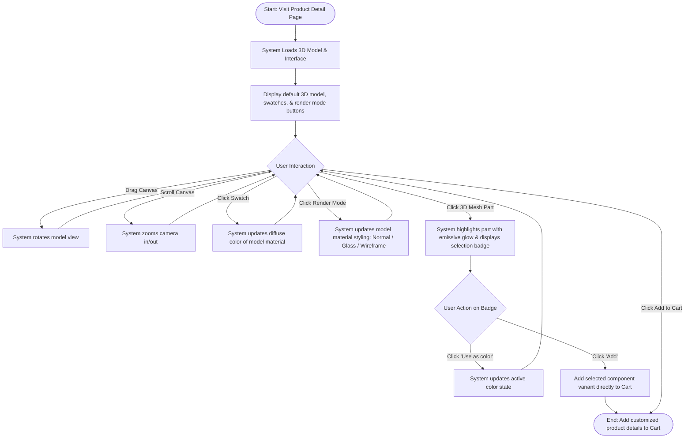
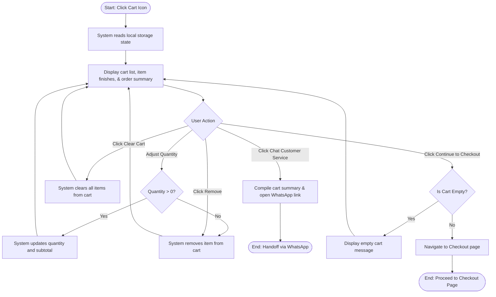
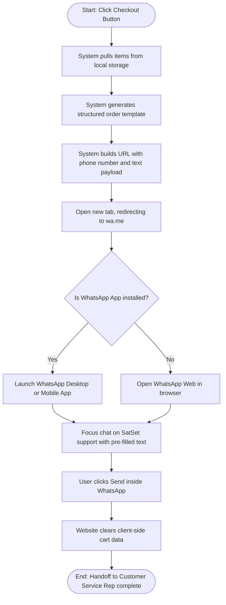

# Team Project Assignment #4 : Activity Design & Paper Prototyping

**Project Title**: SatSet — Office Utility, Refined  
**Team**: SatSet  
**Date**: November 2025  

---

## 1. Activity Diagrams

These diagrams map user actions, decisions, and system responses for our three key use cases:

### Activity Diagram 1: Customize 3D Product (UC-01)

---

### Activity Diagram 2: Manage Shopping Cart (UC-02)

---

### Activity Diagram 3: Checkout via WhatsApp (UC-03)

---

## 2. Interaction Metaphors

Our interface utilizes everyday interaction metaphors to reduce cognitive friction and align user expectations:

| Use Case | Interaction Metaphor | Rationale / Appropriateness | Implications & Constraints |
| :--- | :--- | :--- | :--- |
| **UC-01: Customize 3D Product** | **The Virtual Workshop Table** | Replicates picking up a prototype accessory, turning it around in one's hand under lighting, and choosing color coatings. | Built using WebGL (Three.js). Offers orbit and zoom controls with touch-hijack prevention on mobile. Includes render modes (Normal, Glass, Wireframe) and component direct manipulation (part selection with `#ffd54f` emissive highlight). |
| **UC-02: Manage Cart** | **The Shopping Tray** | Mimics placing physical selections onto a felt checkout tray with generous white-space. Items are laid flat for clear visual organization before payment. | Lists items with custom finish details in text (e.g. `Finish: #hex`). Uses static primary images as thumbnails rather than dynamic 3D renders due to client-side caching limitations. |
| **UC-03: WhatsApp Checkout** | **The Cashier Conversation** | Replaces cold automated forms with a friendly messaging thread to confirm billing, shipping, and payments with a human agent. | Compiles local cart state into a structured order template text passed into the WhatsApp URL payload. Clears local cart data upon redirection. |
| **UC-04: Access Documentation** | **The Editorial Lookbook** | Reading specs and material guides (like 6061-T6 alloy) feels like opening a premium lifestyle design journal or architecture lookbook. | Employs large serif headings, asymmetric layouts, and GSAP ScrollTrigger scroll-linked fade animations to keep technical guides aesthetically engaging. |
| **UC-05: Process Payment & Delivery** | **The Physical Waybill / stamp** | Order confirmation and tracking are represented visually to reassure users that their digital order is transitioning to a physical courier. | Since final verification is handled manually over WhatsApp, tracking is managed within the chat thread where the CS agent sends monospace-formatted waybills and stamp indicators. |

---

## 3. Paper Prototyping

Before building the high-fidelity Next.js platform, we drafted a low-fidelity UI layout in Figma to structure user paths.

### Screen 1: The Product Detail Page (Customizer Interface)
* **Static Elements**: 
  - Header Navbar (Logo on the left, Menu in the middle, Cart and Currency buttons on the right).
  - Specifications Box on the right (Static typography highlighting weight, anodised finish, and RFID shielding features).
  - Horizontal Color Swatch dots underneath the title.
* **Dynamic Canvas Area**:
  - A centered grey placeholder box representing the WebGL interactive zone.
  - Directional icon guides instructing the user: "Click and drag to rotate, pinch/scroll to zoom".
  - Hover states on swatches showing immediate background color swaps.

### Screen 2: The Cart View
* **Static Elements**:
  - Title: "Ready to checkout."
  - Bottom Footer showing brand copy.
* **Dynamic List Panel**:
  - Vertical stack of selected items.
  - Plus/Minus button outlines surrounding quantity counts.
  - Instant recalculation feedback: Subtotal = Quantity $\times$ Price, shifting dynamically without page reloads.

### Screen 3: The Checkout & WhatsApp Redirection View
* **Static Layout**:
  - Split column grid. Left side: Delivery notes, Contact rules. Right side: Grand totals with shipping estimates.
* **Redirection Trigger**:
  - Large button: "Confirm order via WhatsApp".
  - A helper modal dialog popping up if the user completes the action, confirming: *"Order summary copied to clipboard. Redirecting to WhatsApp Customer Support..."*
