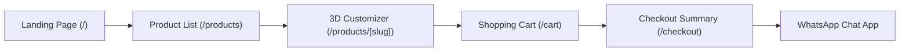

# SatSet — Final Project Report

**Class**: Human-Computer Interaction  
**Semester**: Even Semester 2025/2026  
**Team**: SatSet  
**Members**: Ken Prasetya, Aqsha Rahman, Cent Prabowo, Jes Kartika, Kelvin Wijaya  

---

## 1. Problem & User Analysis

### 1.1 The Problem Domain
Modern professionals exist in highly fluid workspaces, frequently transitioning between home desks, corporate offices, coffee shops, and transit hubs. This lifestyle requires carrying high-value personal objects (credit cards, access badges, IDs, transit passes, cash, writing utensils) safely and cleanly. 

However, existing physical carry gear is often bulky, lacks modern security measures like RFID shielding, or is visually uninspired. Furthermore, when purchasing these premium design objects online, customers experience high friction: standard e-commerce sites rely on flat 2D photography, which fails to convey the three-dimensional form, tactile finish, weight, and assembly tolerances of high-end materials. This leads to buyer hesitation, high return rates, and mismatched aesthetic expectations.

**SatSet** solves this twin challenge by introducing a refined line of minimalist physical carry utilities—headlined by the anodised aluminium *CardHolder Pro*—coupled with an interactive 3D WebGL web customizer and a low-friction, direct-communication checkout flow.

### 1.2 Target User Population
Our user base is divided into two distinct primary user classes and supported by administrative stakeholders:

1. **The Minimalist Desk Worker (Primary)**: Aged 22–45, working in tech, design, or business roles. They have high aesthetic standards, maintain carefully curated workspaces, and value clean geometric structures, premium finishes, and modern web interfaces. They use desktop computers to customize objects to match their keyboard cases or desk mats.
2. **The Active Urban Commuter (Primary)**: Aged 20–35, working in dense metropolitan areas. They prioritize lightweight gear, secure RFID protection, immediate card retrieval, and speed. They primarily browse the system via mobile screens while on transit.
3. **The Customer Service Representative (Stakeholder)**: Processes incoming WhatsApp confirmation details, manages payment validations, and coordinates shipping.
4. **The Platform Administrator (Stakeholder)**: Manages catalog configurations and monitors frontend diagnostics.

### 1.3 Key User Tasks and Goals

| User Class | Task Name | Goal / Success Criteria |
| :--- | :--- | :--- |
| **Minimalist Desk Worker** | Inspect Chamfers and Tolerances | Rotate and zoom the cardholder 3D model in real-time to check edge corners from all angles. |
| **Minimalist Desk Worker** | Harmonize Accessory Colors | Swap model materials between Brand Dark (`#231711`), Mountain, and Sand swatches. |
| **Active Commuter** | Verify Security & Dimensions | Locate specifications detailing the "RFID Shielding" and "18g weight". |
| **Active Commuter** | Rapid Checkout Handoff | Convert their shopping cart into a direct WhatsApp chat with pre-filled order details in under 3 clicks. |
| **Active Commuter** | Return to Previous Selections | Instantly recall previously configured products via a "Recently Viewed" section. |

---

## 2. Design

### 2.1 Aesthetic Theme & Typography
To reflect the quiet, premium quality of SatSet products, the website design avoids generic, saturated palettes. Instead, it utilizes a curated design system:
* **Color System**: Primary background tones are pure white or very light stone, contrasted against a deep, custom brand-dark charcoal `#231711` token. Accents use soft sand and muted greens.
* **Typography**: Large editorial headings utilize elegant serif typography (evoking high-end design magazines), while details, cart lists, and specifications are laid out in a high-readability sans-serif typeface (Inter).
* **Grid Background**: A dynamic three.js particle grid matches page scroll speeds, keeping the interface feeling reactive and alive.

### 2.2 Screen Walkthrough & Flow



1. **Landing Page (`/`)**: Features an editorial hero layout, displaying a large interactive WebGL cardholder that rotates as the user scrolls. Smooth GSAP timelines reveal statistics and call-to-actions.
2. **Products Catalog (`/products`)**: Displays grid cards with subtle hover scaling, showing pricing, colors, and direct access links.
3. **Product Configuration Page (`/products/[slug]`)**: The core interactive workspace. Left column: Interactive `@react-three/fiber` 3D Canvas. Right column: Color swatches, spec list, verified review block, and "Add to Cart" actions.
4. **Cart View (`/cart`)**: A clean grid showing selected items, variant details (e.g. "CardHolder Pro - Warm Sand"), quantity adjusters, and live subtotal calculations.
5. **Checkout Page (`/checkout`)**: Formulates the final summary. Displays contact instructions and redirects the user to WhatsApp via the generated `wa.me` path.

### 2.3 Design Decisions Motivated by Evaluations

#### Phase A: Paper Prototyping Insights
Early low-fidelity layouts placed specifications in a separate tab, hiding crucial capacity information. Evaluators noted that active commuters check capacity immediately. Consequently, we redesigned the details layout to place specifications prominently on the main details column, eliminating extra clicks.

#### Phase B: Heuristic Evaluation Insights
* **The Blank Canvas Problem**: Early WebGL loads resulted in empty boxes. We introduced `src/components/ui/GlobalLoadingLayer.tsx` and static image fallbacks so the page is never visually empty during asset compilation (Visibility of System Status).
* **Swipe-Traps on Mobile**: Touch gestures inside the 3D canvas originally hijacked page scrolling. We resolved this by constraining touch inputs, requiring a double-tap to focus orbital controls on mobile browsers (User Control and Freedom).

#### Phase C: User Testing Insights
* **Orbit Camera Sensitivity**: During user testing, participants using laptop trackpads experienced rapid 3D rotation shifts. We adjusted orbit damping and rotation speeds in `src/components/3d/CardHolderScene.tsx` to smooth out movements.
* **WhatsApp Handoff Clarity**: Users felt unsure when redirected to WhatsApp without prior warning. We added explicit explanation blocks in `src/app/checkout/page.tsx` describing the secure boutique confirmation flow, easing transaction trust concerns.

### 2.4 Alternatives Considered
* **Fully Database-Backed Cart vs. Client-Side Cart**: We considered using database tables to store cart states. However, because our prototype required a low-depth backend to maintain rapid load speeds, we opted for client-side React Context backing into `localStorage`. This eliminated server round-trips and ensured instant cart responses.
* **Integrated Payment API vs. WhatsApp Handoff**: We evaluated integration with Midtrans or Stripe. Given that local Indonesian customers frequently consult support regarding shipping ranges and customization details, we opted for WhatsApp redirection. This keeps trust high and allows manual negotiation of courier choices before payment confirmation.

---

## 3. Technical Implementation

### 3.1 Architecture Overview
The platform is built using the **Next.js App Router** framework. Components are organized by domain under `src/components/` (layout, sections, 3d, ui), and pages reside in the `src/app/` folder structure.

```text
src/
├── app/                  # Next.js App Router pages
├── components/
│   ├── 3d/               # WebGL Scenes and GLB loaders
│   ├── layout/           # Shared Navbar and Footer
│   ├── sections/         # Landing and Product view blocks
│   └── ui/               # Low-level interactive blocks
├── contexts/             # Cart, Auth, Currency, Loading states
├── data/                 # Static catalog data files
└── hooks/                # Custom React hooks (useResolvedColor, etc.)
```

### 3.2 Core Technologies Implemented
* **WebGL / Three.js**: Implemented using `@react-three/fiber` and `@react-three/drei`. The GLTF model is loaded asynchronously. Color swatches update model meshes via React state prop propagation.
* **Animations**: GSAP (GreenSock Animation Platform) and `ScrollTrigger` orchestrate hero mount text splits, stat counter updates, and fade-ins.
* **State Management**: Built using four primary React Context Providers:
  1. `CartProvider` (manages items, subtotals, and persists to local storage).
  2. `CurrencyProvider` (updates pricing text formatting dynamically).
  3. `AuthProvider` (handles mock session validations).
  4. `LoadingProvider` (coordinates pacing animations during route changes).

### 3.3 Usability Impact of Technical Challenges
* **Next.js SSR Hydration Warnings**: In early builds, the `Navbar` component experienced hydration mismatches due to differences in server-rendered local storage states vs. browser states. This caused slight layout shifts. We resolved this by using a `mounted` check hook inside client elements, ensuring stable loads.
* **3D Asset File Size**: The raw GLB models were originally over 15MB, causing long WebGL loading lags. We optimized the files into compressed formats (`/satset3d/glb/bener-final-optimized.glb` at ~1.8MB) and enabled cache headers, ensuring instantaneous page loading.

---

## 4. Evaluation Results

### 4.1 User Testing Methodology
We conducted formal evaluations with 5 users (U-01 through U-05). Users were asked to complete 3 task scenarios while thinking aloud. We measured usability using the **System Usability Scale (SUS)** and user experience dimensions via the **User Experience Questionnaire (UEQ)**.

### 4.2 Usability Findings
* **SUS Score**: SatSet achieved an average score of **83.0** (Grade A, Excellent). The layout was perceived as highly intuitive and simple.
* **Even-Numbered Question Insights**:
  * *Trackpad Orbit Speeds*: Addressed by reducing canvas orbit sensitivity.
  * *WhatsApp Redirection Anxiety*: Addressed by adding explicit process instructions on the checkout review panel.
* **UEQ Scores**:
  * *Attractiveness* (1.88) and *Novelty* (2.10) ranked as "Excellent", proving that interactive 3D WebGL configuration and GSAP transitions create a premium, engaging experience.
  * *Dependability* (1.45) ranked as "Good", indicating that adding explanatory text to the checkout page successfully mitigated transaction concerns.

### 4.3 Unsolved Usability Challenges & Recommendations
* **Automated Shipping Fees**: The checkout page uses a static shipping estimate of `$12` / `Rp 15,000`. It does not calculate real-time rates based on user addresses before WhatsApp redirection.
  * *Recommendation*: Integrate a RajaOngkir API helper on the Checkout page to fetch dynamic courier costs before exporting the summary to WhatsApp.
* **Order Status Tracking**: Once the handoff to WhatsApp occurs, the customer cannot track their order status on the website.
  * *Recommendation*: Implement a simple receipt database table where users can check their order invoice progress (e.g., `/orders/[id]`) after payment confirmation.

---

## 5. Reflection & Learnings

### 5.1 Iterative Design Process Insights
The iteration from paper prototyping to heuristic analysis, and finally to real-user testing, was crucial. Designing in code early allowed us to catch technological constraints (such as mobile swipe capture issues and WebGL loading times) that flat Figma wireframes could never reveal.

### 5.2 What We Would Do Differently
If we were to repeat this project, we would alter our approach in the following ways:
1. **Optimize 3D Assets First**: We spent considerable time fixing WebGL bottlenecks mid-development. Compressing models and creating low-poly meshes should be standard step-one guidelines.
2. **Introduce Interactive Fallbacks Early**: Rather than treating non-WebGL users as an edge case, we would design high-fidelity static image swappers concurrently to guarantee accessibility across older mobile devices from day one.
3. **Structured User Interviews**: We would perform data gathering with more diverse commuter demographics to better refine the early Product Requirement Document.

---

*The SatSet platform demonstrates that interactive 3D rendering combined with tailored, minimal styling can elevate standard e-commerce into a premium brand experience.*
